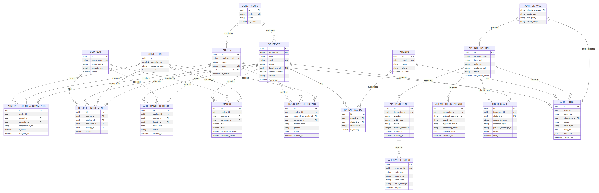
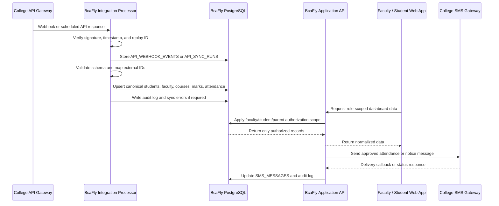

# BcaFly Platform Architecture for Institutional Data Integration

## Purpose

This document describes a production database and integration architecture for BcaFly. The target operating scale is **600 or more students, 14 faculty members, six academic semesters, parent accounts, attendance, marks, mentoring records, audit logs, and future institutional services**.

The central design decision is to treat the college system as an external source of institutional truth. BcaFly should not connect the browser directly to the college API, SMS provider, or database. A server-side integration processor must validate, normalize, authorize, persist, and audit every external record before it is displayed in the platform.

## ER diagram

The editable Mermaid source is available at [`bcafly-platform-erd.mmd`](./bcafly-platform-erd.mmd).

## Entity responsibilities

| Area | Primary entities | Responsibility |
|---|---|---|
| Identity and organization | `DEPARTMENTS`, `FACULTY`, `STUDENTS`, `PARENTS`, `PARENT_WARDS` | Institutional people, departments, ward relationships, and stable identifiers |
| Semester and academic structure | `SEMESTERS`, `COURSES`, `COURSE_ENROLLMENTS` | Six-semester curriculum and each student’s semester-specific course access |
| Authorization scope | `FACULTY_STUDENT_ASSIGNMENTS` | The authoritative faculty-to-student relationship for mentor and instructor access |
| Academic records | `ATTENDANCE_RECORDS`, `MARKS` | Attendance events, CIA marks, assignments, and examination data |
| Faculty workflow | `COUNSELING_REFERRALS` | Faculty-created referrals with protected clinical information outside the faculty view |
| College gateway integration | `API_INTEGRATIONS`, `API_SYNC_RUNS`, `API_WEBHOOK_EVENTS`, `API_SYNC_ERRORS` | Connector credentials, imports, webhook deduplication, retries, and error handling |
| Notifications | `SMS_MESSAGES` | College-provided or optional SMS gateway delivery state and provider message IDs |
| Governance | `AUDIT_LOGS` | Authentication, authorization decisions, imports, changes, and sensitive reads |

## Recommended live data flow

## College API gateway and processor design

The college gateway should be treated as a **trusted integration partner**, not as an unrestricted database connection. Obtain the official API base URL, authentication method, documented resources, rate limits, field definitions, webhook signing rules, and support contact from the college IT team before enabling production sync.

BcaFly should use an adapter per gateway contract. The adapter converts external records into a stable internal format. For example, a college field such as `student_uid` should map to `STUDENTS.external_student_id`, while BcaFly’s internal UUID remains the primary key for local relationships.

The processor should support both of the following patterns:

1. **Webhook-first synchronization.** The college gateway sends events such as `student.updated`, `attendance.finalized`, or `marks.published`. BcaFly verifies the event signature, rejects stale or duplicated events, stores the event metadata, and queues processing.
2. **Scheduled reconciliation.** A background job periodically requests changed records using a cursor, `updated_since` value, or official batch endpoint. This repairs missed webhooks and detects deletions or reassignment changes.

The processor should never write directly to the browser session. It should write to the canonical BcaFly database, record the source system and synchronization timestamp, and expose only normalized application API responses to the frontend.

For every imported entity, retain an external identifier and source metadata. A production implementation should add fields such as `source_system`, `external_id`, `source_updated_at`, and `last_synced_at` to the canonical tables or to an entity-mapping table. This prevents duplicate students when the college changes names or roll numbers.

## Authentication and authorization

Authentication establishes who the user is. Authorization establishes what that authenticated user may read or change. These concerns must be implemented on the server and must not depend on hidden frontend buttons.

Use an institutional identity provider through **OIDC or SAML** when the college already provides one. If that is not available, use a managed identity service with password hashing, refresh-token rotation, optional multi-factor authentication, account lockout, and administrative recovery procedures. Store provider subject IDs and role assignments, not raw passwords, in the application database.

Recommended access rules are:

- A student may read only their own profile, semester data, attendance, marks, documents, notices, and assigned mentor contact details.
- A parent may read only the explicitly linked ward records in `PARENT_WARDS`. Parent contact cards are read-only.
- A faculty member may read and update only students connected through an active `FACULTY_STUDENT_ASSIGNMENTS` row for the relevant semester.
- An administrator may manage departmental records according to institutional policy.
- Counseling referral creation is available from the faculty workflow, but private therapeutic notes must not be returned to faculty or parent clients.
- Integration processors may write only the entities and fields granted to the connector. A marks connector should not be able to modify user credentials.

Every API endpoint should derive the actor from the verified access token and apply a database query scope. Do not accept `facultyId`, `studentId`, or `parentId` from the browser as proof of authority. Those values may be filters, but the server must compare them with the authenticated identity and assignment tables.

## Database security

Use PostgreSQL with private network access, encrypted connections, daily backups, point-in-time recovery where available, and a separate least-privilege database role for the application. Migration privileges, read-only reporting privileges, and runtime application privileges should be separate.

Use parameterized queries or a trusted ORM. Never concatenate roll numbers, email addresses, search strings, or external IDs into SQL. Validate all imported payloads against an allow-listed schema before they reach the database.

Protect sensitive data with the following controls:

- Encrypt database and object-storage volumes at rest.
- Use TLS for browser-to-API, processor-to-gateway, and API-to-SMS communication.
- Keep API keys, OAuth client secrets, SMS credentials, and signing keys in a secret manager, never in Git or frontend environment variables.
- Store documents in private object-storage buckets and return short-lived signed URLs.
- Mask phone numbers and email addresses in logs.
- Do not place counseling remarks, passwords, refresh tokens, or gateway secrets in audit metadata.
- Apply retention policies to raw webhook payloads and sensitive logs.
- Use immutable or append-only audit storage for high-value events.
- Rate-limit login, password reset, webhook, import, and search endpoints.
- Verify webhook signatures and reject old timestamps or reused event IDs.

## SMS gateway integration

If the college provides the SMS gateway, treat it as an optional connector behind an internal notification adapter. The rest of BcaFly should call a stable interface such as `sendAttendanceAlert()` rather than calling a provider-specific URL throughout the codebase.

The adapter should accept only approved message templates and should write an `SMS_MESSAGES` row before dispatch. After submission, it should store the provider message ID and status. Delivery callbacks should be verified, deduplicated, and mapped to `queued`, `sent`, `delivered`, `failed`, or `unknown` states.

If the college gateway is temporarily unavailable, attendance and marks must still be saved. Notifications should move to a retry queue and should not block the academic transaction. A dead-letter queue or `API_SYNC_ERRORS` record should preserve failures for operational review.

## Live display of student and faculty details

The browser should read from the BcaFly application API, not directly from the college gateway. For ordinary dashboard views, request paginated data with a semester and assignment filter. For a live attendance or marks update, use one of these options:

- Server-sent events for one-way updates from BcaFly to the browser.
- WebSockets when the faculty dashboard requires bidirectional session behavior.
- Short polling when the college gateway does not support events and the update frequency is low.

The processor should publish a domain event after a successful import, such as `attendance.updated` or `marks.published`. The API can then invalidate a dashboard cache and notify connected clients. The UI should show the source timestamp and synchronization status so users can distinguish current gateway data from the last successful sync.

## Operational checks before production

Before connecting real student data, confirm the following with the college IT team:

- Official gateway base URL and environment separation between test and production.
- Authentication method, credential rotation process, and IP allow-list requirements.
- Student, faculty, semester, course, attendance, marks, and timetable endpoints.
- External identifier guarantees and update/deletion semantics.
- Webhook signing algorithm, replay protection, retry policy, and event catalog.
- SMS submission endpoint, templates, sender ID, delivery callbacks, and failure codes.
- Data retention, consent, privacy, and incident-notification requirements.
- Expected request limits and planned synchronization windows.

Do not connect a gateway solely because it is reachable or because it has an API-looking URL. Require official documentation, a test credential, a sandbox or test tenant, and a named college owner for the integration.

## References

[1]: https://owasp.org/www-project-application-security-verification-standard/ "OWASP Application Security Verification Standard"

[2]: https://openid.net/specs/openid-connect-core-1_0.html "OpenID Connect Core 1.0"

[3]: https://www.postgresql.org/docs/current/ddl-rowsecurity.html "PostgreSQL Row Security Policies"

[4]: https://www.rfc-editor.org/rfc/rfc8446 "The Transport Layer Security Protocol Version 1.3"
